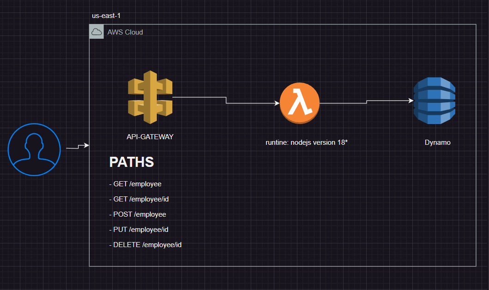

# CRUD employees with serverless
## Architecture


## Installation
1. Configure aws credentials
```bash
$ aws configure
AWS Access Key ID [None]: <YOUR_ACCESS_KEY_ID>
AWS Secret Access Key [None]: <YOUR_SECRET_ACCESS_KEY>
```
2. Create rol for lambda function
```bash
aws iam create-role --role-name <ROL_NAME> --assume-role-policy-document file://trust-policy.json
```
Example Policy
```json
{
    "Role": {
        "Path": "/",
        "RoleName": "<ROL_NAME>",
        "RoleId": "ABCDEFGHIJKLMNOPQRSTU",
        "Arn": "arn:aws:iam::123456789012:role/<ROL_NAME>",
        "CreateDate": "2021-01-01T12:00:00Z",
        "AssumeRolePolicyDocument": {
            "Version": "2012-10-17",
            "Statement": [
                {
                    "Effect": "Allow",
                    "Principal": {
                        "Service": "lambda.amazonaws.com"
                    },
                    "Action": "sts:AssumeRole"
                }
            ]
        }
    }
}
```
3. Install serverless framework
```bash
npm install -g serverless
```
4. Install dependencies
```bash
npm install
```
5. Deploy
```bash
serverless deploy
```